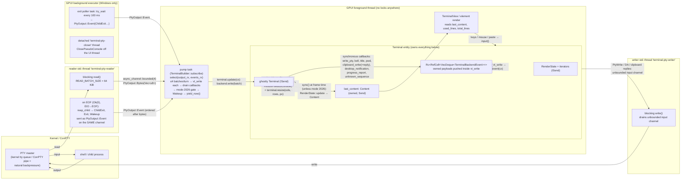

# PTY and threading architecture for the libghostty-vt terminal (v2)

Status: **Decided for v2** (2026-08-26, ticket [#30](https://github.com/xipeng-jin/zed/issues/30), map [#27](https://github.com/xipeng-jin/zed/issues/27)).
Supersedes: the v1 record of the same name on `migration/libghostty` (resolved 2026-07-15, last at `e537270dac`, written against ghostty `a887df42c5` and *before* the P4 landing). Re-validated at the v2 baseline (`migration/libghostty2` = `main` @ `38c5dd7c98`, ghostty `8867c37c5`, libghostty-rs `de9fd9b0fa`, portable-pty 0.9.0 / wezterm `8afe0ad307`); §0 lists what changed against v1 so the diff is legible.

Sources of truth read for this note:

- Zed seam (`migration/libghostty2`): `crates/terminal/src/{terminal.rs,alacritty.rs,pty_info.rs}`, `crates/terminal_view/src/{terminal_view.rs,terminal_scrollbar.rs}`, `Cargo.toml`, `.github/workflows/*`.
- v1 execution record (`migration/libghostty`): `crates/terminal/src/pty.rs` (P4 landing, `566b794a6f` + `2425954382` + `1b452bb116`), `docs/ghostty-migration/divergence-ledger.md` (P4-005), `.github/workflows/pty_integration.yml`, ticket #45 (P4 landing summary; ConPTY forensic record; §8.2 amendment).
- ghostty `8867c37c5`: `include/ghostty/vt/{terminal.h,render.h,screen.h,io.h}`, `src/lib_vt.zig`, `src/lib/TinyIo.zig`, `src/terminal/c/{terminal.zig,sys.zig}`, `src/terminal/{stream.zig,render.zig,modes.zig}`, `src/termio/Thread.zig`, `src/renderer/generic.zig`, and commits `da04b65d4`, `82df79ec8`, `a69a591af`.
- libghostty-rs `de9fd9b0fa`: `crates/libghostty-vt/src/{terminal.rs,render.rs,alloc.rs,fmt.rs,io.rs}`, `crates/libghostty-vt-sys/src/bindings.rs`.
- portable-pty: `~/.cargo/registry/src/index.crates.io-*/portable-pty-0.9.0` and the wezterm checkout at `8afe0ad307` (`~/.cargo/git/checkouts/wezterm-*/8afe0ad`).

---

## 0. What changed against v1

| Point | v1 (2026-07-15) | v2 (2026-08-26) |
|---|---|---|
| (1) PTY layer | portable-pty 0.9.0 behind a Zed seam; git pin for the Windows `kill()` fix noted as a hazard | **Re-confirmed.** crates.io still at 0.9.0 (2025-02-11); the inverted `TerminateProcess` check is verified by diff against the pin, so the pin `8afe0ad307` stays mandatory. |
| (2) Ownership | `!Send` core on the GPUI foreground inside the `Terminal` entity | **Re-confirmed.** `init_single_threaded` and `TinyIo` remove a per-instance TLS block and signal handlers; they add no thread, no shared state, and the header contract is unchanged. libghostty-rs still has zero `Send`/`Sync` impls. |
| (3) Threads / channel / pump | Predicted: bounded(4)×64 KiB byte channel; pump "carrying bytes" with the 4 ms coalescing timer left to validation | **Amended to the landed P4 shape**: exit events ride the byte channel (`PtyOutput::Event`), pump ingests ≤4 batches per turn then yields, **no timer** (ledger P4-005 accepted: 84.2 MiB/s, 2.2 ms max stall). |
| (4) Batch boundary | not considered (`vt_write_until_ground` did not exist) | **No split at parser ground** — `vt_write` already recovers from any split losslessly and `until_ground` costs 1–5 %. **New: a DEC 2026 snapshot gate** on the pump (skip `RenderState::update`/`Wakeup` while mode 2026 is set, 1000 ms watchdog) because ghostty, unlike alacritty's vte, does not absorb BSU/ESU below the API. |
| (5) Lock-held reads | n/a (predates #52454/#62504) | **New section.** Every read has a terminal-level getter (`SCROLLBACK_ROWS`, `TOTAL_ROWS`, `CURSOR_X/Y`, `SCROLLBAR`, `ACTIVE_SCREEN`); `Row::is_clear` becomes a Zed-side `HAS_TEXT` scan; the "cannot lock inside `sync()`" constraint disappears; page-granular eviction needs a non-monotonic `SCROLLBACK_ROWS` guard. |
| (6) Callback queue | `Rc<RefCell<VecDeque>>`, sync-answer callbacks from `Rc<Cell>` state | **Re-confirmed, extended.** The clipboard-write "reply" is a stack-frame function pointer that *must* be called before the callback returns — synchronous for Zed's unconditional-copy policy. Three new fire-and-forget variants (desktop notification, progress, unknown sequence). libghostty-rs's `on_clipboard_write` binds the pre-reply ABI → #33. |
| (7) Windows | ConPTY hazards listed; exit via `try_wait` suggested | **Re-confirmed as landed**: 100 ms `try_wait` poller (background task, not a thread), detached `terminal-pty-closer` thread with inline-drop fallback, pinned `kill()`; §8.2 substrate constraint carried; hosted runners are advisory only (what they can/cannot prove is stated in §3.7). |

Dropped from v1: §4 "how ghostty itself does it" (its `lockDemand`/`yieldToDemand` fairness apparatus and 4-buffer pipeline are historical context; the numbers survive as the constants in `pty.rs`), and the §8 open questions that other tickets have since closed (OSC 52 read, color queries, scrollback setter → #29; selection/search → #35).

---

## 1. Decision summary

| # | Decision | One-line rationale |
|---|---|---|
| **D1** | **PTY layer: `portable-pty`, git-pinned to wezterm `8afe0ad307`, behind the Zed-owned `crates/terminal/src/pty.rs` seam** (salvaged by file from v1 P4). | Only workspace dep candidate; API maps 1:1 onto `pty_info`'s needs on both platforms; `pre_exec` subsumes the alacritty-fork `SignalMask` fix; the pin carries the Windows `kill()` fix that 0.9.0 lacks (`src/win/mod.rs:40-49` is inverted). |
| **D2** | **Ownership: the GPUI foreground owns the `!Send` ghostty `Terminal` + `RenderState`, stored in the `Terminal` entity. No mutex, no `unsafe`.** Reader/writer `std::thread`s move only `Send` byte buffers. | `T: 'static` is all GPUI entities need; the C contract is "one terminal, one thread, callbacks synchronous inside the write" (`terminal.h:78-83`) and `RenderState::update` takes `&Terminal` (`render.rs:327-370`), so the two-phase lock split is unusable cross-thread in safe Rust anyway. Preserves the entity's synchronous API and removes the lock wait the foreground already pays today. |
| **D3** | **Event flow: ghostty callbacks push owned payloads into an `Rc<RefCell<VecDeque<TerminalBackendEvent>>>` drained right after each `vt_write`; sync-answer callbacks (size, DA, color scheme, enquiry/XTVERSION, clipboard-write reply) answer inline from foreground state.** Exit events ride the byte channel behind every byte already read. | Callbacks borrow their payload only for the call and may not re-enter `vt_write`; replying inside the callback is *required* for clipboard writes (`terminal.h:548-552,598-601`); PTY write-back ordering is preserved by construction. |
| **D4** (new) | **Pump contract: ≤ `MAX_BATCHES_PER_TURN`(4) × `READ_BATCH_SIZE`(64 KiB) of `vt_write` per foreground turn, then `yield_now()`; no coalescing timer; batches are *not* split at parser ground; after each turn, `RenderState::update`/`Wakeup` are gated on DEC mode 2026 with a 1000 ms watchdog.** | P4-005 (measured) settles the timer; `stream.zig:685-702` shows `vt_write` already resynchronises at any boundary so `until_ground` buys nothing for 1–5 % cost; ghostty's render state does not check 2026 (`src/terminal/render.zig`), so synchronized output must be honoured at the snapshot, exactly as ghostty's own renderer does (`generic.zig:1275-1278`, `Thread.zig:38`). |

---

## 2. Thread / lock / data-flow diagram

**Where the lock would be: nowhere.** Every touch of the ghostty `Terminal` — `vt_write`, `resize`, selection/scroll mutation, terminal-level data reads, the per-frame `RenderState::update` — happens on the single foreground thread that owns it. The cross-thread hand-offs are `Send` byte buffers (reader → foreground, bounded) and `Send` byte cows (foreground → writer, unbounded: a stalled child blocks the writer thread, not the UI). Backpressure: after four unconsumed batches the reader blocks, the kernel PTY queue fills, the child's `write()` stalls.

---

## 3. Per-point re-validation

### 3.1 (1) PTY layer — re-confirmed: portable-pty, pinned, behind `pty.rs`

- **Version.** crates.io `max_version = 0.9.0`, `updated_at = 2025-02-11` (queried 2026-08-26). Zed `main` has `portable-pty = "0.9.0"` (`Cargo.toml:741`); sole consumer `acp_thread` uses only `portable_pty::ExitStatus::from` (`crates/acp_thread/src/terminal.rs:501,539`). v1 replaced the workspace entry with `{ git = "https://github.com/wezterm/wezterm", rev = "8afe0ad30739c5aa106c19e8a75b1dfc83bcfb56" }` (v1 `Cargo.toml:728`); `acp_thread` rides the pin unchanged since `ExitStatus` is untouched.
- **Why the pin is still mandatory.** 0.9.0 `src/win/mod.rs:40-49` (`WinChild::do_kill`): `let res = TerminateProcess(...); if res != 0 { Err(err) } else { Ok(()) }` — inverted (`TerminateProcess` returns nonzero on success). `WinChild::kill` swallows it with `.ok()` (`:54-57`) but `WinChildKiller::kill` (`:71-79`) does not, and a `clone_killer()` killer is exactly what `pty.rs` stores (v1 `pty.rs:98,197`) — so on 0.9.0 every *successful* Windows kill reports `Err`. wezterm `8afe0ad30` ("pty: windows: fix kill() (#7709)") has `if res == 0 { Err(err) } else { Ok(()) }` (`pty/src/win/mod.rs:41-50`). No newer crates.io release carries it.
- **API adequacy (unchanged).** `MasterPty::{resize, try_clone_reader, take_writer, process_group_leader, as_raw_fd, tty_name}` (`src/lib.rs:88-117`); `Child::{try_wait, wait, process_id, as_raw_handle}` (`:130-146`); `ChildKiller: Send + Sync` separable via `clone_killer` (`:150-157`). Unix `pre_exec` (`src/unix.rs:238-274`) resets SIGCHLD/HUP/INT/QUIT/TERM/ALRM, clears `sigprocmask`, `setsid()`, `TIOCSCTTY`, `close_random_fds()` — still subsumes the alacritty-fork `SignalMask` fix. Unix kill = `SIGHUP` (`src/lib.rs:322-333`), matching alacritty's `Pty::drop`.
- **Seam.** `crates/terminal/src/pty.rs` (v1 P4) is the swap point and is salvaged **by file** under salvage-policy rule 3; only `terminal.rs` integration hunks are re-derived. Its `pub(super)` surface: `PtyOutput`, `output_channel()`, `PtyHandle` (`shutdown`, `resize`, `Drop`), the reader/writer spawners, and the Windows exit poller.

### 3.2 (2) Ownership — re-confirmed: foreground-owned `!Send` core; the runtime changes do not touch the contract

- **Header contract, verbatim** (`terminal.h:78-83`, repeated at `:2039-2042`): "All callbacks are invoked synchronously during VT writes. Callbacks must not call ghostty_terminal_vt_write() or ghostty_terminal_vt_write_until_ground() on the same terminal (no reentrancy). And callbacks must be very careful to not block for too long … since they are blocking further IO processing." `terminal.h:44-51`: "libghostty-vt does not create a timer or background thread." The continuation export adds: "The caller must serialize this operation with ghostty_terminal_vt_write() and all other access to the same terminal."
- **`render.h:29-34,42-52,435-448`**: the two-phase `begin_update`/`end_update` split exists so a *renderer* thread can hold the lock briefly — but the safe binding's `RenderState::update`/`begin_update` take `&Terminal` (`render.rs:327-370`), pinning `RenderState` to the terminal's thread. Under D2 there is one thread, so plain `update` is used and the split is moot.
- **`init_single_threaded`** (`da04b65d4`, 2026-07-21): "The C API is assumed to be single-threaded per VT instance … init_single_threaded does not register signal handlers … matches the execution model of the C VT API (single-threaded/not thread-safe within a single VT instance)." **`TinyIo`** (`82df79ec8`, 2026-08-09): "only supports the operations we need and doesn't support concurrency … runtime memory requirements by over 256KB (the thread-local storage std.Io.Threaded creates … is gone). TinyIo is POSIX-only: Windows keeps std.Io.Threaded". `src/terminal/c/terminal.zig:52-95`: `TerminalWrapper.io` is `lib.TinyIo` on POSIX (stateless, `src/lib/TinyIo.zig:1-38`: "plain blocking syscalls … doesn't support concurrency operations"; no `threadlocal`, no globals) and a per-terminal heap-allocated `std.Io.Threaded.init_single_threaded` on Windows, freed in `deinit`. The Io is used only for Kitty-graphics temp-file reads (`lib_vt.zig:40-49`), which v2 compiles out (`-Dvt-features=-kitty_graphics`, #28). Process-wide mutable state in the C layer: only `src/terminal/c/sys.zig:87 var global` (the `ghostty_sys` hooks, set once at startup) and `lib_vt.zig:167 msvc_fltused`. **Verdict: no new thread, no cross-terminal state; the contract is unchanged.**
- **libghostty-rs `de9fd9b`**: `grep -rn "unsafe impl (Send|Sync)" crates/libghostty-vt/src` → none. `Terminal<'alloc,'cb>` = `Object<'alloc, ffi::TerminalImpl>` (`NonNull`, `alloc.rs:48-49`) + `Box<VTable>` of `'cb` closures without `Send` bounds (`terminal.rs:224-229`); `RenderState<'alloc>(Object<…>)` (`render.rs:224`); formatter/selection handles carry `PhantomData<&'t Terminal>` (`fmt.rs:20,27`). Both auto-`!Send`/`!Sync`, as in v1.
- **Why not a dedicated terminal thread** (unchanged from v1, restated): it turns `sync`, selection, search, `used_lines`, cwd reads into async round-trips or stale mirrors; the reader/writer channel seams are identical under either design, so ownership can be hoisted later without touching `pty.rs`. **Why not `unsafe impl Send` + mutex**: unsound-by-contract (the binding documents possible thread-local state; Windows keeps a per-terminal `Io.Threaded`).

### 3.3 (3) Threads, channel, exit transport, pump — amended to the landed P4 design

Constants (v1 `pty.rs:28-50`): `READ_BATCH_SIZE = 64 * 1024`, `OUTPUT_CHANNEL_BATCHES = 4`, `MAX_BATCHES_PER_TURN = 4`, `EXIT_POLL_INTERVAL = 100 ms` (`#[cfg(windows)]`).

- **Exit rides the byte channel.** `pub(super) enum PtyOutput { Bytes(Vec<u8>), Event(TerminalBackendEvent) }` over `async_channel::bounded(OUTPUT_CHANNEL_BATCHES)` (v1 `pty.rs:52-65`): "Exit-sequence events travel on this channel — not a side channel — so they cannot overtake still-queued output bytes." The reader thread drains every byte, then `reap_child`, then sends `ChildExit → Exit → Wakeup` (`exit_event_sequence`, `:438-446`) — subsuming alacritty's `drain_on_exit` by construction. The separate `events_rx` (`PtyEvent`) channel carries only Zed-side pty events. **v1's doc had exit on the `PtyEvent` channel; the landed design is the correct one and v2 adopts it.**
- **Reader** `terminal-pty-reader` (`:375-418`): `read()` up to 64 KiB, `send_blocking`; on receiver-gone keeps draining and still reaps; Linux slave-hangup `EIO` → EOF handled by portable-pty. **Writer** `terminal-pty-writer` (`:423-430`) drains an `async_channel::unbounded` (`:210`). **Shutdown** (`:127-136`): close input channel, `killer.lock().kill()`, reader drains/reaps/exits.
- **Pump** (v1 `terminal.rs:1646-1681`, `TerminalBuilder::subscribe`): `futures::stream::select(output_rx, events_rx)`; on `Bytes`, one `terminal.update` calls `backend.write(&bytes)` then `try_recv`s up to `MAX_BATCHES_PER_TURN` more `Bytes` — breaking and processing inline on an `Event` so exit stays ordered — then `process_event(Wakeup)`, then `yield_now().await`. **No timer.** Today's upstream pump (`terminal.rs:1352-1414` on `main`) has a 4 ms coalescing window and a >100-event break because *events* cross the channel while bytes are parsed elsewhere; when the foreground parses bytes itself, the batch cap does that job.
- **Ledger P4-005 (verbatim, accepted)**: "no timer. Each turn ingests up to `MAX_BATCHES_PER_TURN × READ_BATCH_SIZE` (4 × 64 KiB) then yields; each emulator-origin event gets its own update … the empirical validation open question 6 asked for is the P4 sustained-flood benchmark: 84.2 MiB/s through the seam, max per-turn foreground stall 2.2 ms (release), echo latency ≤ 623 µs mean 264 µs during flood; interactive rows re-verified on the `:99` harness. Coalescing knobs remain a post-removal tuning rider (SPEC.md §6) if a real regression appears." These numbers are carried as **`unverified` for v2** (salvage rule 4) and re-fire with the perf re-run under #37.

### 3.4 (4) `vt_write_until_ground` / continuation — batches are not split at ground; a mode-2026 gate is added

- **What `until_ground` does** (`terminal.h:2081-2111`; `src/terminal/c/terminal.zig:910-935` → `src/terminal/stream.zig:607-654`): consumes "only the shortest prefix needed to reach ground" (finishes a pending UTF-8 codepoint byte-by-byte, `stream.zig:641-647`, then `consumeUntilGround`, `:650-652`); at ground already → consumes 0; `NO_VALUE` if the whole slice was consumed without reaching ground. Cost "anywhere from 1% to 5% slower than nextSlice" (`stream.zig:617-620`) and the tail after ground is not fed. Its stated purpose (`a69a591af`, 2026-08-12) is to "let embedders safely interleave custom VT sequences from multiple sources … doing custom APC or something mid-stream". `DATA_VT_GROUND` (`terminal.h:1921-1933`) is the read-only probe.
- **Why the plain pump is already safe at any boundary.** `nextSliceCapped` (`stream.zig:685-702`) begins *every* `vt_write` by draining pending UTF-8 → `consumeUntilGround` → `consumeAllEscapes` → SIMD scan to the next ESC; the `TerminalWrapper` keeps a persistent stream precisely "to handle escape sequences split across multiple vt_write calls" (`c/terminal.zig:97-100`). Screen state is mutated only on dispatch (CSI final byte, OSC/DCS/APC terminator, complete codepoint; DCS accumulates via `dcs_put` and applies at `dcs_unhook`, `stream.zig:109-111`); partial sequences live in parser buffers and touch no cell. `RenderState.beginUpdate` reads only `flags.dirty`/`screens.active.dirty` (`src/terminal/render.zig:373-400`), never parser state. Callbacks fire inside `vt_write` and are drained after it on the same thread, so no event is observable before its grid effect. **There is no parser-level torn-snapshot risk; splitting at ground would cost 1–5 % plus a non-SIMD tail per batch for nothing.** Zed injects nothing into the VT stream (Zed→terminal traffic goes to the PTY writer), so the interleaving use case has no consumer.
- **Continuation** (`OPT_CONTINUATION_MAX_BYTES`, `terminal.h:1421-1439`; `continuation_write/buf/alloc`, `:2113-2190`): opt-in retention of "the exact byte suffix needed to reconstruct unfinished VT parser or UTF-8 decoder state"; disabled by default; adds `trackContinuation` per feed when on (`stream.zig:602-605`). Irrelevant to the pump; if #37 adopts snapshots as golden state it is read between writes on the same thread.
- **The consistency mechanism that *does* need handling is DEC mode 2026.** Today alacritty's `vte` absorbs BSU/ESU inside the event loop (`event_loop.rs:166,229`: `sync_bytes_count`, `sync_timeout`), so Zed never sees a partial frame. In ghostty, 2026 is an ordinary mode (`src/terminal/modes.zig:327`); `src/terminal/render.zig` never checks it; ghostty's own renderer skips the frame while it is set (`src/renderer/generic.zig:1275-1278`: "If we're in a synchronized output state, we pause all rendering") and its IO thread arms a **1000 ms** watchdog that force-clears the mode (`src/termio/Thread.zig:38 sync_reset_ms = 1000`, `:378-390`; `stream_handler.zig:711-714`); resize also clears it (`Terminal.zig:3997,4047`). **D4**: after each pump turn read mode 2026 (`DATA_MODE`, `GhosttyTerminalModeConfig`); while set, skip `RenderState::update` and do not emit `Wakeup`; arm a GPUI foreground timer (1000 ms, ghostty's number; alacritty used 150 ms) that clears the mode via `OPT_MODE` and forces a snapshot. This is a gate on the snapshot step, not a change to batch size or boundary. (v1 §5.A.3 anticipated this via `Mode::SYNC_OUTPUT`; it is now a stated decision.)
- **Borrowed-string lifetime.** `DATA_TITLE`/`DATA_PWD` are "valid until the next mutating terminal call" (`terminal.h:1659-1665,1671-1677`; tightened from "next vt_write/reset"). libghostty-rs's `title()`/`pwd()` return `&str` tied to `&self` (`terminal.rs:884-890`), so the borrow checker already forbids holding them across `vt_write(&mut self)`. D3 copies to an owned `String` inside the callback drain — satisfies both wordings.

### 3.5 (5) #52454 / #62504 reads under a foreground-owned core with no lock

Rule: every "read while `sync()` holds the lock" becomes "read on the foreground between `vt_write` batches". Pump and `sync()` share the foreground, so no `vt_write` can interleave with any read; only *which* boundary a read sits at matters.

**What is read under the lock today** (`main` @ `38c5dd7c98`):

| Read | Where | Under D2 |
|---|---|---|
| `term.history_size()` | `terminal.rs:1781,1792` — comment `:1790-1791`: "history_size must be read here since process_hyperlink cannot lock term (sync() already holds the lock)" | `GHOSTTY_TERMINAL_DATA_SCROLLBACK_ROWS` (15, "total rows minus viewport rows", `terminal.h:1686-1691`). The constraint vanishes; `process_hyperlink` may read the getter itself (keep the parameter only to keep it pure for tests). |
| `display_offset(term)` | `:1720,1771` | `GHOSTTY_TERMINAL_DATA_SCROLLBAR` (9) → `{total, offset, len}` (`terminal.h:1625-1635`); header: "poll this once per frame or per write batch and diff" — the `sync()` cadence. |
| `make_content` (`alacritty.rs:882-931`): `total_lines`, `display_offset`, `columns`, `screen_lines`, `history_size`, cursor cell, `adjusted_last_hovered_word` | `:2342` | `TOTAL_ROWS` (14), `SCROLLBAR`, `COLS`/`ROWS` (1/2) or render-state `DATA_COLS/ROWS` (`render.h:146-149`); `grid_lines_change` from the `TOTAL_ROWS` delta + `SCROLLBAR.offset` between consecutive `sync()`s; `GHOSTTY_RENDER_STATE_DATA_DIRTY` (3, `render.h:152`) short-circuits `Unchanged`. |
| `grid().cursor.point.line` + `history_size` | `write_input` on `\r` (`:2170-2176`) → `pending_cwd_boundary = scrollback_position(...)` **before** `write_to_pty`; fallback in `record_cwd_change` (`:2846-2849`) | `GHOSTTY_TERMINAL_DATA_CURSOR_Y` (4, "row position within the active area", `terminal.h:1584-1589`) + `SCROLLBACK_ROWS`. Terminal-level, not the render-state cursor (`render.h:300-343`, viewport-relative, may be absent). Same moment, same semantics, no lock. |
| `used_lines` (`alacritty.rs:809-821`): `ALT_SCREEN`, `total_lines`, cursor line, `screen_lines`, `grid[Line(n)].is_clear()`, `history_size` | `terminal.rs:1910-1920`, consumed per frame by `terminal_view.rs:350-363` (embedded terminals) — three separate `lock_unfair()`s per frame today | `ACTIVE_SCREEN` (6), `TOTAL_ROWS`, `CURSOR_Y`, `ROWS`, `SCROLLBACK_ROWS`. **No row-level "empty" flag exists** (`GHOSTTY_ROW_DATA_*`: WRAP, WRAP_CONTINUATION, GRAPHEME, STYLED, HYPERLINK, SEMANTIC_PROMPT, KITTY_VIRTUAL_PLACEHOLDER, DIRTY — `screen.h:260-317`); implement `is_clear` as "no cell has `GHOSTTY_CELL_DATA_HAS_TEXT`" (`screen.h:175`) over `ROW_DATA_CELLS_RAW` (`render.h:249-265`), scanning bottom-up `ROWS-1 → CURSOR_Y+1` on a bottom-pinned view. Whether a styled-but-blank row counts is the `used_lines` parity-row call (#29, row "used_lines P"). Becomes a plain method call during render. |
| `cursor_style().blinking`, `colors()[i]` | `:1602-1606`, `:1622-1634` | `DATA_CURSOR_STYLE` (10); `ColorRequest` disappears (ghostty answers OSC 4/10/11 internally; #29/#31). |

**Where the cwd event comes from today, and the ordering hazard.** Zed does not use OSC 7: `record_cwd_change` is called only from `pty_info.rs:229` — an OS cwd poll spawned on `Wakeup` (`terminal.rs:1614-1620`). The row paired with a change is the `\r`-time capture or, as a fallback, "cursor line when the poll lands". So "record at the row where the OSC arrived" is not something Zed does today; a foreground-owned core is exactly as precise, and *more* precise becomes possible: if Zed later adopts ghostty's `pwd_changed`/`title_changed` callbacks (fire synchronously inside `vt_write`, `terminal.h:1006-1027`), the callback must snapshot `SCROLLBACK_ROWS + CURSOR_Y` **inside the callback** (getters are non-mutating; the terminal is quiescent during a callback) and push `(row, owned String)` onto the D3 queue — reading after `vt_write` returns would be off by whatever output followed the OSC in the batch. That is the one place where "read at the batch boundary" is insufficient; it belongs to the map's `CURSOR_AT_PROMPT`/OSC 133 fog, and #30 only fixes that the queue payload can carry a row captured in-callback.

**Eviction.** `cwd_at_line` gives up once `history_size >= scrolling_history` (`:2870-2874`). ghostty prunes at page granularity, first-reached of bytes/lines (recon 6/6 §3), so `SCROLLBACK_ROWS` can drop by a page's rows at once. Treat any non-monotonic decrease in `SCROLLBACK_ROWS` between reads as "cap reached" in addition to the `>= max_lines` guard. Routed to #29 row "cwd history P".

### 3.6 (6) Callback queue given the reply-style clipboard write and the new callbacks — re-confirmed, extended

Full `Effects` vtable at `8867c37c5` (`src/terminal/c/terminal.zig:273-289`, fn types `:297-355`):

| Callback | Nature | D3 handling |
|---|---|---|
| `write_pty(term, ud, bytes, len)` | fire-and-forget; bytes borrowed for the call | copy → `PtyWrite` → writer channel (stream order preserved) |
| `bell`, `title_changed`, `pwd_changed` | fire-and-forget; read `DATA_TITLE`/`DATA_PWD` in the callback | copy to `String` → `Title`/`Pwd` queue events |
| `desktop_notification({title, body})` (`terminal.h:820-847`) | fire-and-forget; strings borrowed | new `DesktopNotification{title, body}` variant; no consumer — debug log until a product ticket |
| `progress_report({state, progress})` (`:855-898`) | fire-and-forget | new `ProgressReport{state, progress}` variant; same |
| `unknown_sequence({tag=APC, value})` (`:398-412,1478-1497`; needs `OPT_UNKNOWN_MAX_BYTES > 0`) | fire-and-forget | new `UnknownSequence{bytes, truncated}` variant; off by default (triage aid) |
| `color_scheme(*out) -> bool`, `device_attributes(*out) -> bool` (copied to `da_features_buf`, `c/terminal.zig:291-296`), `size(*out) -> bool` (XTWINOPS + mode-2048 report), `enquiry`/`xtversion -> GhosttyString` ("memory must remain valid until the callback returns", `:312-319`) | **synchronous answer** | answered inline from `Rc<Cell<Size>>`, static strings, and the theme — all foreground-visible under D2 |
| `clipboard_write(const GhosttyClipboardWrite*)` (`terminal.h:490-624`) | **synchronous reply via `write->reply`** | see below |
| `clipboard_read(const GhosttyClipboardRead*)` (`:719-723,1516-1524`; "must be answered before the callback returns") | sync reply | left NULL (#29 policy = alacritty `OnlyCopy`) |

**Clipboard-write reply contract.** `GhosttyClipboardWrite {size, location, contents*, contents_len, name, granted, can_remember, ctx, reply}`; `GhosttyClipboardWriteReply {size, result, remember}`. `terminal.h:548-552`: "This must happen within the clipboard write request callback. This struct is only valid during that time. Calling `reply` more than once is safely ignored. Returning without replying denies the write." `:598-601`: "The embedder may ask for permission to write or perform the write async, but the callback itself is synchronous and the reply function must be called during the lifetime of this function. While this callback is active the VT stream is paused." The implementation confirms it: `ClipboardWriteCtx` and `request` are **stack locals** of `clipboardWriteTrampoline` (`c/terminal.zig:426-437`) and the reply trampoline dereferences that frame (`:441-455`) — replying after return or from another thread is a use-after-return. `result` only reaches protocols with an ack (OSC 5522); OSC 52 / OSC 1337 discard it (`:497-502`). **Consequence:** "async-style" means the *write* may be deferred, not the reply. Zed's policy is unconditional copy, so the callback copies each `contents[i]` into owned `Vec<u8>`, pushes `ClipboardStore{location, contents}` onto the queue, and calls `reply(SUCCESS, remember=false)` before returning. Queue shape unchanged; one added call.

**Binding gap → #33.** libghostty-rs `de9fd9b` binds the *pre-reply* ABI: `ffi::ClipboardWrite` is `{size, location, contents, contents_len}` (`bindings.rs:2282-2295`) and `on_clipboard_write` returns `ffi::ClipboardWriteResult` (`terminal.rs:2037-2051`); against `8867c37c5` the C callback returns `void` and the struct has grown. `CLIPBOARD_READ` and `UNKNOWN_SEQUENCE` have no binding; `vt_write_until_ground`/`DATA_VT_GROUND` are unbound (`terminal.rs:301-303` binds `vt_write` only). The re-vendor must regenerate these; the safe wrapper should expose `ClipboardWrite::reply(self, …)` consuming the borrow so once-only-in-callback is enforced by the type system.

**Queue invariants.** Every fire-and-forget callback borrows its payload only for the call → every queued event owns its data. No callback requires `Send`; none may re-enter `vt_write` → the drain runs after the write returns (as v1 did). `self.events: VecDeque<InternalEvent>` (Zed-side, drained by `sync()`) stays a plain field on `&mut self`; only the ghostty-callback queue needs `Rc<RefCell<…>>`, because the C callbacks run while `vt_write(&mut self)` holds the terminal borrow.

### 3.7 (7) Windows — re-confirmed as landed; what hosted runners can and cannot prove

**Design (v1 P4, carried).**
- **Exit observation**: ConPTY reader EOF arrives only after `ClosePseudoConsole`, so EOF cannot signal exit. A `BackgroundExecutor` task (not a thread; `spawn_exit_poller`, v1 `pty.rs:493-533`) calls `try_wait` (`GetExitCodeProcess` vs `STILL_ACTIVE`, portable-pty `src/win/mod.rs:26-38,88-90`) every `EXIT_POLL_INTERVAL = 100 ms` under the shared child mutex; on exit it `take()`s the child so the reader's later `reap_child` returns `None`, and sends the exit sequence on the byte channel. A fixed timer is used instead of the `pty_info` refresh because that refresh is wakeup-driven and a silently exiting child produces no wakeups (`pty.rs:44-50`). `WaitForSingleObject` on `as_raw_handle` is the documented fallback.
- **Closer thread**: `PtyHandle::Drop` hands the master to a detached `terminal-pty-closer` thread (`pty.rs:139-171`; commit `2425954382`): `ClosePseudoConsole` can block until output drains while the reader is blocked sending into the bounded channel whose only consumer is the dropping thread — the UI foreground in production. Inline-drop fallback if thread spawn fails (`1b452bb116`): "forgetting the master instead would leak the pseudoconsole and its conhost for the process lifetime, so a rare blocking close (spawn only fails under resource exhaustion) is the lesser evil."
- **Kill**: `TerminateProcess` via the pinned `kill()` fix (§3.1).

**Substrate constraint (#45, signed 2026-07-21, SPEC v1 §8.2).** On GitHub-hosted `windows-latest` (Server 2022), ConPTY sessions through portable-pty emit a ~20-byte preamble (`ESC[6n` …) and then starve: the child never executes, `STILL_ACTIVE` forever, shape varying per runner instance. Ruled out with commits: workflow YAML (`pty::` filter must be quoted), `core.longpaths` + `CARGO_NET_GIT_FETCH_WITH_CLI` (both mechanical fixes must be re-applied), MSVC quoting, test interleaving, cold start, gpui timers, null std handles, the in-box conhost (a sideloaded modern OpenConsole reproduced it). The no-GPUI control (run 29603970998) starved identically → substrate, not Zed code. Untried: `windows-2025` image; case-sorted environment block under `CREATE_UNICODE_ENVIRONMENT`.

**What P4-equivalent acceptance can be proven on GitHub-hosted runners:**
- Windows compilation and clippy of the seam and `pty.rs`;
- the `TerminateProcess → try_wait → exit sequence` path (the one ConPTY shape green in every run);
- all non-PTY Class A/B unit tests;
- weakly, that the closer thread does not hang the dropping thread (the 90-minute hang stopped after `2425954382`).

**What cannot be proven there** — anything requiring the child to execute and emit bytes: spawn/echo, resize read-back, exit status of a normally exiting child, shutdown-without-EOF-wait with output in flight, kill mid-output, orphan checks. Therefore the P4 item "PTY suite green on Windows CI incl. ConPTY shutdown/exit/kill" is dischargeable only on a self-hosted Windows runner plus the §8.2 real-hardware smoke (pwsh echo, resize, one-shot task exit, the P4-001 `cmd.exe` quoting probe, close mid-output, quit with live terminals).

**Upstream substrate at the v2 baseline**: every Windows job in upstream Zed CI (`run_tests.yml`, `run_bundling.yml`, `release*.yml`, `after_release.yml`; 11 occurrences) uses `self-32vcpu-windows-2022`; no hosted Windows runner exists upstream. That label resolves only in upstream's org — on the fork it queues forever unless a runner with that label is attached. **v2 keeps the amendment unchanged**: Linux PTY suite gating; fork's hosted Windows job advisory (`continue-on-error: true`, with the two mechanical fixes); Windows Class A/B + the three-test ConPTY suite bind on `self-32vcpu-windows-2022` (at upstreaming) and at the §8.2 gate (#40).

---

## 4. DisplayOnly / headless subprocess mapping (unchanged in substance, re-cited)

- `TerminalBuilder::new_display_only` (`terminal.rs:937-1040`) + `Terminal::write_output` (`:1892-1908`) is **already a foreground parse** on the calling thread (`convert_lf_to_crlf` → lock → `Processor::advance` → `Wakeup`); under D2 it becomes `backend.write(&converted)` + the callback drain. `make_display_only_terminal()` tests (`:5705-5850`, the #52454 cwd tests) never parse bytes and carry over unchanged (Class B).
- `spawn_task_subprocess` (`:3172-3270`) parses stdout and stderr with two `Processor`s under the lock from a background task — impossible with a `!Send` core. v2: both pipes feed the same bounded `PtyOutput::Bytes` channel; one parser on the foreground; inter-pipe ordering is already arbitrary today (independent lock holds), so nothing is lost. Exit detection stays a `try_status` poller (20 ms) on the background executor sending `ChildExit`/`Exit` as `PtyOutput::Event`. `SubprocessHandle` and `Drop for Terminal` (`:3157-3160`, `:3274-3276`) are unchanged.

---

## 5. Feeds into other tickets

- **#33 (vendoring)**: regenerate bindings for the reply-style `ClipboardWrite` (`bindings.rs:2282-2295` is stale), bind `CLIPBOARD_READ`/`UNKNOWN_SEQUENCE`, `vt_write_until_ground`/`DATA_VT_GROUND` (unused by the pump; bind for completeness), `DATA_MODE`/`OPT_MODE` for the 2026 gate.
- **#29 rows**: `used_lines` styled-blank semantics; cwd-history eviction guard (non-monotonic `SCROLLBACK_ROWS`).
- **#36 (seam/phases)**: `pty.rs` salvaged by file; `TerminalBuilder::subscribe` hunk re-derived against the new `main` pump (`:1352-1414`) with the 2026 gate added; three new `TerminalBackendEvent` variants.
- **#37 (verification)**: P4 flood/latency numbers re-fire as `unverified`; the Windows acceptance split above is the CI matrix input; a 2026 BSU/ESU conformance case (frame not snapshotted mid-BSU; watchdog fires at 1000 ms).
- **#40 (gates)**: §8.2 constraint carried verbatim; `windows-2025` and the env-block ordering remain non-binding diagnostics.
- **Map fog**: in-callback `(row, pwd)` capture for a future OSC 7/133 producer stays under the `CURSOR_AT_PROMPT` fog item.
