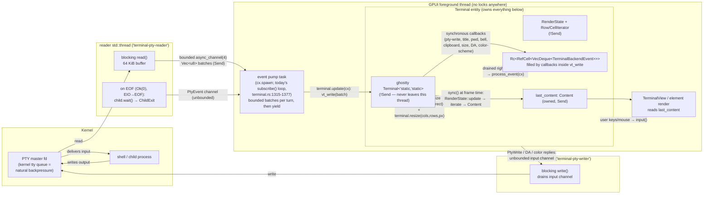

# PTY and threading architecture for the libghostty-vt terminal

Wayfinder ticket: xipeng-jin/zed#30 — what replaces alacritty's `tty` module and
`EventLoop`, and what threading model owns the ghostty `Terminal` inside Zed.

All Zed paths are relative to the repo root. External source trees referenced:

- **libghostty-rs**: `~/Projects/refs/libghostty-rs` (the vendored binding)
- **ghostty**: `~/Projects/refs/ghostty` (upstream Zig application + C headers)
- **alacritty fork**: `~/.cargo/git/checkouts/alacritty-20195d12a03fa0c5/4c12966`
  (zed-industries/alacritty rev `4c129667…`, per `Cargo.lock`)
- **portable-pty 0.9.0**: `~/.cargo/registry/src/index.crates.io-*/portable-pty-0.9.0`
  (already resolved in Zed's `Cargo.lock:13773`)

---

## 1. Decision summary

| # | Decision | One-line rationale |
|---|----------|--------------------|
| **D1** | **PTY layer: adopt `portable-pty`** behind a thin Zed-owned module (the successor of `crates/terminal/src/alacritty.rs`), with Zed-owned reader/writer threads. | Already a workspace dependency (`Cargo.toml:720`, used by `crates/acp_thread`); exposes exactly what `pty_info.rs` needs on both platforms; ships a ConPTY backend for the Windows follow-up; ~0 new code vs. a ~1,200-LOC unix-only port whose event loop is coupled to the vte parser we are deleting. |
| **D2** | **Ownership: the GPUI foreground thread owns the `!Send` ghostty `Terminal` (and `RenderState`), stored directly in the `Terminal` entity.** A dedicated reader `std::thread` ships raw byte batches over a *bounded* channel to the existing foreground event pump, which calls `vt_write`; a writer thread drains an input channel. No mutex, no `unsafe`. | GPUI entities require only `T: 'static` and foreground tasks need not be `Send`, so this is legal; it preserves the entity's large synchronous API surface (the highest-risk part of the migration); backpressure via the bounded channel + kernel PTY buffer replaces ghostty's mutex-fairness machinery outright. The channel seam is kept identical to the dedicated-thread alternative, so ownership can be hoisted off the UI thread later without touching the PTY layer. |
| **D3** | **Event flow: register ghostty's callbacks as `'static` closures that capture `Rc<RefCell<VecDeque<TerminalBackendEvent>>>` (plus small `Rc<Cell<…>>` state for synchronous-answer callbacks).** Callbacks fire synchronously inside `vt_write` — which, under D2, is always the foreground thread — and the queue is drained through the existing `process_event` immediately after each `vt_write`, preserving PTY write-back ordering. Reader-thread-origin events (`ChildExit`) keep using the existing `PtyEvent` channel. | Ghostty's vtable is synchronous-by-design (`terminal.rs:77-79` of the binding); running it on the thread that already owns the entity turns every event into ordinary foreground code, and answer-required callbacks (`on_size`, `on_device_attributes`, `on_color_scheme`) can return synchronously from foreground-visible state — impossible to do without round-trips in any cross-thread design. |

---

## 2. Thread / lock / data-flow diagram

**Where the lock would be: nowhere.** Every access to the ghostty `Terminal` —
`vt_write`, `resize`, selection/scroll mutation, and the per-frame
`RenderState::update` — happens on the single foreground thread that owns it.
The only cross-thread hand-offs are `Send` byte buffers (reader → foreground)
and `Send` byte cows (foreground → writer). The bounded reader channel is the
backpressure valve: when the foreground falls behind, the reader blocks, the
kernel PTY queue fills, and the child's writes stall — the same flow-control
mechanism ghostty documents for its 4-buffer pipeline
(`src/termio/Exec.zig:1530-1535`: gather blocks when all buffers are in flight,
"which is exactly when we should stop reading and let the kernel queue exert
backpressure on the child").

---

## 3. Per-decision analysis

### 3.1 D1 — PTY layer: `portable-pty`, not a port, not from scratch

**What the layer must provide** (from Zed's current seam):

- Unix `openpty` + shell spawn with cwd/env, setsid + controlling TTY
  (`crates/terminal/src/alacritty.rs:177-183` wraps `tty::new`).
- Handles for `PtyProcessInfo`: on unix a raw master fd + child pid
  (`alacritty.rs:64-69` builds `ProcessIdGetter::new(pty.file().as_raw_fd(), pty.child().id())`;
  the fd feeds `libc::tcgetpgrp` at `crates/terminal/src/pty_info.rs:37` and the pid is the
  fallback at `pty_info.rs:42-44`); on Windows a raw process handle + pid
  (`alacritty.rs:71-82`, consumed by `GetProcessId` at `pty_info.rs:50-66`).
- Resize ioctl (`TIOCSWINSZ`), child-exit observation, and a future ConPTY path.

**Option A — port alacritty's `tty` + `EventLoop` into Zed.** Measured against
the actual checkout:

- Size: unix-only ≈ **1,200 LOC** (`tty/unix.rs` ~470 non-test + `tty/mod.rs`
  slimmed ~130 + `event_loop.rs` 486 + `sync.rs` FairMutex 49 + glue); with
  Windows (`windows/{mod,conpty,child,blocking}.rs` ≈ 910 non-test LOC) ≈
  **2,100–2,200 LOC**. Deps (`polling`, `rustix-openpty`, `rustix`,
  `signal-hook`, `piper`, `miow`, `windows-sys`) are all already in Zed's tree.
- The disqualifier is structural, not size: `event_loop.rs` three-way-couples
  the poller timeout to the **vte parser's synchronized-update state** and to
  `Arc<FairMutex<Term<U>>>` — `state.parser.advance(&mut **terminal, …)` runs
  *inside* the loop under the Term lock (`event_loop.rs:154`), the poll timeout
  is derived from `parser.sync_timeout()` (`event_loop.rs:229-231`), and
  chunking is governed by `READ_BUFFER_SIZE = 0x10_0000` / `MAX_LOCKED_READ =
  u16::MAX` (`event_loop.rs:24,27,140-162`). Porting it verbatim ports the
  exact vte+FairMutex architecture this migration exists to remove; porting it
  gutted leaves only the `tty/unix.rs` spawn code — which portable-pty already
  provides.
- One fork-specific asset, `SignalMask` (`tty/unix.rs:59-98`, Zed-authored for
  zed#42234: children spawned from a background thread must not inherit its
  blocked signal mask; threaded through `crates/terminal/src/terminal.rs:1042-1048,1191-1196`),
  is *subsumed* by portable-pty: its `pre_exec` unconditionally clears the
  signal mask with `sigprocmask(SIG_SETMASK, &empty_set, …)` and resets
  SIGCHLD/SIGHUP/SIGINT/SIGQUIT/SIGTERM/SIGALRM to `SIG_DFL`
  (`portable-pty-0.9.0/src/unix.rs:238-271`), so the child always starts with a
  clean mask regardless of which executor thread spawned it.

**Option B — adopt `portable-pty` (chosen).** Verified against the vendored
0.9.0 source and the wezterm repo:

- Already resolved in the workspace: `Cargo.toml:720`
  (`portable-pty = "0.9.0"`), consumed by `crates/acp_thread/Cargo.toml:41`
  (`crates/acp_thread/src/terminal.rs:406,444`). Zero new dependency weight;
  its deps (`nix`, `libc`, `filedescriptor`, `downcast-rs`, `serial2`,
  `winapi`, …, `Cargo.lock:13773-13791`) are already vendored.
- API coverage (all in `portable-pty-0.9.0/src/lib.rs`):
  `PtySystem::openpty(PtySize) -> PtyPair` (lib.rs:267), `SlavePty::spawn_command(CommandBuilder)
  -> Box<dyn Child + Send + Sync>` (lib.rs:165), `MasterPty: Downcast + Send`
  with `resize(PtySize)`, `try_clone_reader() -> Box<dyn Read + Send>`,
  `take_writer() -> Box<dyn Write + Send>`, unix-only
  `process_group_leader() -> Option<pid_t>` (tcgetpgrp, unix.rs:373-378) and
  `as_raw_fd() -> Option<RawFd>` (lib.rs:88-114, unix.rs:366-368);
  `Child::{try_wait, wait, process_id}` (lib.rs:130-141) and Windows-only
  `Child::as_raw_handle` (lib.rs:145). **`ProcessIdGetter` maps 1:1**:
  unix `(master.as_raw_fd(), child.process_id())`; Windows
  `(child.as_raw_handle(), child.process_id())`.
- Spawn semantics match alacritty's: `libc::openpty` + `FD_CLOEXEC`
  (unix.rs:22-46), `pre_exec` does signal reset + `sigprocmask` clear +
  `setsid()` + `ioctl(0, TIOCSCTTY, 0)` (unix.rs:238-271); `CommandBuilder`
  supports `env`/`env_remove`/`env_clear` and `cwd`
  (cmdbuilder.rs:299,342). The unix `Child` is literally `std::process::Child`
  (lib.rs:272-289), so `process_id()` is `child.id()`.
- Child-exit observation: **no SIGCHLD handling; the caller reaps**
  (unix.rs — no signal code; `Child::wait/try_wait` delegate to std). The
  reader's `Read` impl maps `EIO → Ok(0)` so Linux slave-close surfaces as a
  clean EOF (unix.rs read impl; confirmed in wezterm source,
  <https://github.com/wezterm/wezterm/blob/main/pty/src/unix.rs>). Our reader
  thread therefore reaps: on `Ok(0)` it calls `child.wait()` and emits
  `ChildExit(status)` — replacing alacritty's signal-hook SIGCHLD pipe
  (`tty/unix.rs:325-332,430-449`) with strictly less machinery. This also
  subsumes alacritty's `drain_on_exit` (`tty/mod.rs` `Options`,
  `alacritty.rs:168`): a blocking reader by construction drains every byte
  until EOF before reporting exit.
- Costs, acknowledged: blocking reader ⇒ a dedicated thread per terminal
  (section 3.2 wants one anyway); `ChildKiller::kill()` sends SIGHUP on unix
  (maintainers' deliberate choice) — irrelevant to Zed, whose kill paths
  already use `libc::killpg(SIGKILL/SIGTERM)` directly
  (`pty_info.rs:149-175`); slow release cadence (0.9.0 Feb 2025, but `pty/`
  still actively patched — e.g. the Windows `kill()` fix merged 2026-06-07,
  wezterm#7709) — acceptable given the crate is small enough to vendor or fork
  if ever needed; unconditional `serial2` dep (already in the lock file).

**Option C — Zed-owned module from scratch**: everything portable-pty does,
written and maintained by us, with no offsetting benefit at this stage. The
thin wrapper module we write around portable-pty (the `alacritty.rs`
replacement) *is* the Zed-owned seam; if portable-pty ever becomes a
liability, only that wrapper's internals change. Rejected as a starting point,
retained as the exit strategy.

### 3.2 D2 — Ownership: foreground-thread ownership, dedicated threads only for blocking I/O

**The constraint surface.** libghostty-vt types are `!Send`/`!Sync` by design —
"all `libghostty-vt` types are `!Send` … since the C API is allowed to use
thread-local state; they are also `!Sync` … as the C API is not guarded with
mutexes" (`crates/libghostty-vt/src/lib.rs:50-72`). The binding's own
recommendation, verbatim (same passage): "in a complex program we encourage you
to create the terminal on a separate thread (or task in async programming), and
use channels to communicate … Under sufficient load, it is generally more
efficient to offload terminal emulation to its own operating system-level
thread." GPUI offers exactly two safe homes for a `!Send` value:

1. **The foreground thread.** `ForegroundExecutor::spawn` requires only
   `Future + 'static` / `R: 'static` (`crates/gpui/src/executor.rs:314-317`;
   the executor itself is `!Send` via `not_send: PhantomData`,
   `executor.rs:285,305-309`), and **entities require only `T: 'static`**
   (`crates/gpui/src/app/entity_map.rs:114-122,156,423`) — so the ghostty
   `Terminal` can live as a plain field of the Zed `Terminal` entity.
2. **A dedicated `std::thread`.** `BackgroundExecutor::spawn` demands
   `Send` futures and outputs (`executor.rs:89-91`), so the shared pool is
   out; but raw threads are established Zed practice
   (`crates/fs/src/fs_watcher.rs:1115`, `crates/http_proxy/src/proxy.rs:184`,
   `crates/gpui_linux/src/linux/platform.rs:1295` spawns a writer thread, and
   alacritty's own loop was a named thread, `event_loop.rs:205-206`).

A third option — `Mutex` + `unsafe impl Send` wrapper, replicating ghostty's
Zig architecture literally — is rejected outright: it asserts precisely the
guarantee the binding authors refuse to make (thread-local state in the C API,
`lib.rs:58-60`), and CLAUDE.md forbids unsafe workarounds without clear
justification. If upstream ever certifies thread mobility, this can be
revisited; until then it is unsound-by-contract.

**Why foreground ownership wins over a dedicated terminal thread.**

*(a) The per-frame snapshot is already a foreground full copy — and the
foreground already blocks on the parser today.* Zed renders from
`last_content`, rebuilt every frame by `sync()` → `make_content`, which locks
the FairMutex **on the foreground** and copies the entire visible grid
(`terminal.rs:2262-2271`, `alacritty.rs:807-848`). Meanwhile alacritty's IO
thread holds that same lock for up to `MAX_LOCKED_READ` = 64 KiB of parsing per
acquisition (`event_loop.rs:27,160-162`), and will *force-block* the lock when
1 MiB of unparsed bytes accumulate (`event_loop.rs:140-145`). So today's
worst-case frame stall ≈ one 64 KiB parse *plus* a full-grid copy, arbitrated
by a fair lock. Under foreground ownership the same 64 KiB parse budget is
simply *scheduled* on the foreground instead of *contended for* — the total
foreground work per frame does not increase; the lock-wait disappears; and the
copy itself shrinks because `RenderState::update` is incremental/dirty-tracked
(`render.rs:16-26,34-51`) rather than a from-scratch grid walk.

*(b) The two-phase `begin_update`/`end_update` API — the headline argument for
an IO-thread split — is unusable across threads in safe Rust anyway.* The split
exists "for callers that synchronize access to the terminal state … a caller
can hold its lock for this call only and then call end_update after releasing
it" (`render.rs:362-380`; identically `include/ghostty/vt/render.h:44-52,363-377`).
But `RenderState` is itself `!Send`/`!Sync` (same `Object<NonNull>` wrapper, no
`unsafe impl` anywhere in the crate), and `begin_update` takes `&Terminal`
(`render.rs:381-390`) — so in safe Rust the terminal and the render state are
pinned to the *same* thread, and reading the resulting `Snapshot` (which
mutably borrows the `RenderState`, `render.rs:258`) happens there too. The
lock-split superpower simply does not survive the binding. On a single owning
thread the one-call `update()` is equivalent and simpler (`render.rs:352-360`).
What crosses threads is the *materialized* `Content` — owned and `Send` —
exactly as `make_content` produces today.

*(c) The entity's synchronous API is the migration's biggest risk, and
foreground ownership keeps it intact.* `Terminal` exposes dozens of
lock-and-read/mutate methods used across terminal_view, tasks, and the agent:
`sync()` drains `InternalEvent`s (resize/scroll/selection/vi/clear) against the
live term (`terminal.rs:2262-2271`, handlers at `terminal.rs:1597-1700`),
plus `total_lines`/`viewport_lines` (`terminal.rs:1842-1848`), `get_content`
(`:2279-2282`), `last_n_non_empty_lines` (`:2284-2287`), `select_all`
(`:1879-1884`), `with_renderable_cells` (`:2273-2277`), hyperlink hit-testing
(`alacritty.rs:924-932`), search (`alacritty.rs:1009-1023`). With a dedicated
thread, every one becomes an async round-trip or a stale mirror; drag-selection
and scroll pick up a frame of latency (mouse event → channel → thread applies →
snapshot returns → next frame). With foreground ownership the bodies change
from `self.term.lock()` to plain `&mut self.ghostty_term` — a mechanical,
incremental rewrite, which is what this migration plan demands.

*(d) Flood behavior is solvable with the same mechanism ghostty uses — the
kernel, not a mutex.* The failure mode to design for: `cat huge_file` while the
user resizes. Ghostty bounds lock-hold and gather latency with 64 KiB batches
("One batch is also the unit of work the parse stage does per terminal lock
acquisition, so this bounds both gather latency and lock hold time",
`Exec.zig:1289-1292`) and gets flow control from a 4-buffer ring that blocks
the gather stage, letting "the kernel queue exert backpressure on the child"
(`Exec.zig:1280-1287,1530-1535`). We adopt the same numbers with less
machinery: reader thread → `async_channel::bounded(4)` of 64 KiB batches →
foreground pump processes a bounded number of batches per turn and yields
(today's pump already coalesces on a 4 ms timer, caps at 100 events, and
`yield_now()`s between rounds — `terminal.rs:1324-1373` — the shape survives,
carrying bytes instead of parsed events). At a conservative parse throughput,
4 × 64 KiB per turn is well under a frame budget; if profiling disagrees, the
per-turn cap is one constant. Crucially, ghostty's *entire*
`lockDemand`/`yieldToDemand` starvation apparatus
(`src/renderer/State.zig:36-66` — unfair mutexes let "a running thread that
unlocks and immediately relocks beat a sleeping waiter every time … without
this signal the renderer can starve for as long as the output lasts") is a fix
for a problem the no-lock design cannot have.

*(e) The escape hatch is preserved by construction.* The reader delivers
`Vec<u8>` over a channel and the writer consumes `Cow<'static, [u8]>` over a
channel — identical seams whether the consumer is the foreground pump or a
dedicated terminal thread that owns `Terminal + RenderState` and pushes
`Content` snapshots. If real-world profiling shows parse jank the foreground
caps can't fix, ownership moves behind the same channels (the
binding-recommended architecture) without touching D1 or the PTY threads. The
things that would need rework are exactly the synchronous entity methods —
which is why we don't pay that cost speculatively.

**Resulting thread inventory per terminal:** foreground (owner) + 1 reader
`std::thread` (blocked in `read()`; doubles as the child reaper) + 1 writer
`std::thread` (blocked in channel-recv/`write()`; keeps a stalled child from
ever blocking the UI on `write`, and its drop-EOF semantics
(`unix.rs` `UnixMasterWriter::drop` sends `\n` + VEOF) handle shutdown).
Alacritty used 1 thread + a poller; ghostty uses 4 + app. Two blocked threads
per terminal is the cost of portable-pty's blocking API and is cheap (stack
pages only).

**Callback lifetimes under D2.** `Terminal<'alloc: 'cb, 'cb>` ties callbacks to
the `'cb` parameter (`crates/libghostty-vt/src/terminal.rs:229-235`, trait
bounds `FnMut(…) + 'cb` at `terminal.rs:1498-1510`). Storing the terminal in a
`'static` entity forces `Terminal<'static, 'static>` — i.e. callbacks may
capture only owned/`'static` data. That is not a constraint in practice: the
binding's own guidance is interior-mutability handles ("use types that allow
safe interior mutability … and pass a shared reference into each effect
handler", `terminal.rs:81-93`), and `Rc` clones moved into each closure satisfy
`'static` cleanly. No self-reference arises: the entity owns the `Rc`s and the
terminal; the terminal's vtable owns clones; the callbacks never reference the
entity itself.

### 3.3 D3 — Event flow: synchronous callbacks → foreground queue → existing `TerminalBackendEvent` handling

Ghostty's model: "All callbacks are invoked synchronously during
`vt_write`. Callbacks must be very careful to not block for too long"
(`terminal.rs:77-79`). Under D2 the thread calling `vt_write` is the foreground
thread, inside a `terminal.update(cx, …)` — so callbacks run where `cx` already
lives. The mapping, per callback (registration macro at `terminal.rs:1404`,
handlers at `terminal.rs:1533-1691`):

| ghostty callback | fires when | maps to | mechanism |
|---|---|---|---|
| `on_pty_write` (`:1536-1547`) | DA/DSR/DECRQM responses | `TerminalBackendEvent::PtyWrite` → `write_to_pty` | push bytes into the `Rc<RefCell<VecDeque<…>>>` queue; drained FIFO immediately after `vt_write` returns |
| `on_title_changed` (`:1588-1595`) | OSC 0/2 | `Title(String)` → breadcrumbs (`terminal.rs:1516-1531`) | callback copies `term.title()` (borrowed `&str` valid only until the next `vt_write`, `terminal.rs:617-623` — must be owned before queueing) |
| `on_pwd_changed` (`:1602-1609`) | OSC 7 | new: feeds cwd tracking alongside `pty_info` | copy `term.pwd()` (`terminal.rs:630-636`), queue |
| `on_bell` (`:1551-1558`) | BEL | `Bell` → `cx.emit(Event::Bell)` | queue |
| `on_clipboard_write` (`:1678-1690`) | OSC 52 / OSC 1337 writes | `ClipboardStore(String)` → `cx.write_to_clipboard` | queue (copy contents; borrowed for callback duration only, `terminal.rs:1238-1244`); return `Ok(())` |
| `on_size` (`:1613-1626`) | XTWINOPS 14/16/18 | replaces `TextAreaSizeRequest` | **must answer synchronously** (`-> Option<SizeReportSize>`): read an `Rc<Cell<TerminalBounds>>` the entity updates on every resize |
| `on_color_scheme` (`:1633-1646`) | CSI ? 996 n | new (no alacritty equivalent) | answer from an `Rc<Cell<ColorScheme>>` mirroring the current theme |
| `on_device_attributes` (`:1653-1666`) | CSI c / > c / = c | replaces vte's internal DA handling | answer with a `const` `DeviceAttributes` |
| `on_xtversion`, `on_enquiry` (`:1574-1581,1562-1569`) | CSI > q / ENQ | new | static strings |

**Ordering is preserved for free.** Zed today has an explicit invariant that
color-request responses must stay ordered relative to other PTY writes — "an
application sending `OSC 11 ; ? ST` followed by `CSI c` … would receive the
response to `CSI c` first" if handled out of band
(`terminal.rs:1573-1585`). Under D3 every response-producing callback fires
synchronously *in stream order* inside `vt_write`, and either answers inline
(sync-return callbacks) or lands in one FIFO queue drained before the next
`vt_write` — so responses enter the writer channel in exactly the order the
queries arrived. This is strictly stronger than the current architecture, which
relies on the single event channel plus careful handling.

**What reaches the entity from other threads** stays on the existing
`PtyEvent`/unbounded-channel path (`terminal.rs:743-745`, pump at
`terminal.rs:1315-1377`): byte batches (new), `ChildExit(status)` from the
reader thread after reaping, and `Exit` for abnormal teardown. `Wakeup` is no
longer a channel event at all — the pump emits `cx.emit(Event::Wakeup)` itself
after each round of `vt_write`s (it is already the foreground). Of the current
`TerminalBackendEvent` variants (`terminal.rs:706-721`): `Wakeup`,
`MouseCursorDirty`, `CursorBlinkingChange` become foreground-derived (the last
from `Snapshot::cursor_blinking`, `render.rs:476-478`, compared frame-over-frame);
`ClipboardLoad` has **no ghostty equivalent** — OSC 52 *reads* "are always
ignored and never forwarded" (`terminal.rs:1676-1677`) — see Open questions;
`ColorRequest` likely disappears into libghostty's internal color state
(it owns default/override colors and answers queries via `on_pty_write`) —
verification tracked in Open questions.

---

## 4. How ghostty itself does it — and the mapping onto Zed's seam

Ghostty runs **four dedicated threads per surface** plus the app thread
(`src/Surface.zig:715-728`, `src/termio/Exec.zig:139-144,1436-1440`):

1. **renderer thread** (`src/renderer/Thread.zig`) — frame building;
2. **termio writer thread** (`src/termio/Thread.zig`) — PTY *writes* and control
   messages; its module doc states the split's purpose: "The goal is to offload
   as much from the reader thread as possible since it is the hot path in
   parsing VT sequences" (`Thread.zig:1-9`);
3. **io-reader (parse) thread** — calls `io.processOutput(batch)`
   (`Exec.zig:1469`), which locks and runs the VT stream
   (`src/termio/Termio.zig:643-649`);
4. **io-gather thread** — the `read()` syscalls, feeding a ring of **4 × 64 KiB**
   buffers with condvar hand-off and kernel-queue backpressure
   (`Exec.zig:1280-1292,1338-1384,1530-1535`; motivation: macOS caps each
   master read at ~1 KiB, so a serial read/parse loop stalls producers,
   `Exec.zig:1257-1266`).

The `Terminal` is shared **by mutex, not by thread ownership**:
`renderer_state.mutex` guards "the terminal, devmode, etc."
(`src/renderer/State.zig:13-17`). Who locks: parse thread for one 64 KiB batch
per acquisition (`Exec.zig:1289-1292`); writer thread briefly per control
message (resize `Termio.zig:474-498` — note the ioctl happens *outside* the
lock at `Termio.zig:472`, then "Enter the critical area that we want to keep
small"); the app thread for short reads (key-encode options, selection). The
renderer's frame snapshot is the C API's two-phase split in situ: `updateFrame`
locks via `lockDemand`, runs `terminal_state.beginUpdate(state.terminal)`
inside — "Work that doesn't require terminal access (e.g. style
denormalization) is deferred to the endUpdate call outside of this critical
section, keeping our lock hold time as short as possible"
(`src/renderer/generic.zig:1173-1212`) — and `endUpdate` + link search + GPU
cell building outside. Because unfair mutexes let the hot parse loop starve the
renderer, ghostty adds an explicit demand/hand-off protocol
(`State.zig:36-66`, parse thread yields between batches at
`Exec.zig:1490-1493`). Events to the app go through mailboxes + an `xev.Async`
wakeup, with an unlock-push-relock dance when a queue is full to avoid deadlock
(`src/termio/stream_handler.zig:125-140`, `src/termio/mailbox.zig:61-95`).
Child exit is an `xev.Process` watcher on the writer thread's loop
(`Exec.zig:106-163,272-308`) — no SIGCHLD handler.

**Mapping onto Zed.** Ghostty's architecture answers a question Zed doesn't
have: how to share one terminal between *two non-UI hot loops* (parse thread,
renderer thread). Zed has no renderer thread — GPUI's per-frame view pass *is*
the foreground — so the mutex split would buy Zed nothing except the
starvation problem it forces ghostty to hand-solve. What we take from ghostty
is the load-bearing numerology and layering, relocated:

| ghostty | Zed (this design) |
|---|---|
| io-gather thread + 4×64 KiB ring, kernel backpressure | reader `std::thread` + `bounded(4)` channel of 64 KiB batches |
| io-reader thread parsing one batch per lock hold | foreground pump `vt_write`-ing a bounded number of batches per turn, then yielding |
| writer thread (xev stream writes; "offload the hot path") | writer `std::thread` draining the input channel |
| `renderer_state.mutex` + `lockDemand` fairness | *(no lock — single owner)* |
| `beginUpdate` in-lock / `endUpdate` out-of-lock frame snapshot | single-call `RenderState::update` in `sync()` (`render.rs:352-360`) — the split is moot with one owner |
| resize: ioctl outside lock, `terminal.resize` inside, 25 ms coalescing (`termio/Thread.zig:27-33,376-438`) | resize: `MasterPty::resize` + `terminal.resize` back-to-back in `sync()`; Zed already coalesces pending resizes (`terminal.rs:1966-1969`) |
| surface mailbox + `rt_app.wakeup()` | callback queue drained in-update + `cx.emit` |
| `xev.Process` exit watcher | reader thread reaps at EOF |

**The seam file.** `crates/terminal/src/alacritty.rs` is replaced by a
`ghostty.rs` sibling with the same private surface (`terminal.rs:63-73`
imports): `open_pty` → portable-pty `openpty`+`spawn_command`;
`spawn_event_loop` → spawn reader/writer threads, return a `PtySender`-shaped
handle (`notify`/`resize`/`shutdown`, today `alacritty.rs:84-108`) where
`notify` feeds the writer channel, `resize` calls `MasterPty::resize` and
queues the terminal-side resize, `shutdown` closes the writer channel and kills
the child to unblock the reader; `new_term` → `Terminal::new` + callback
registration + `RenderState`/`RowIterator`/`CellIterator` construction;
`make_content` → `RenderState::update` + row/cell iteration
(`render.rs:189-246`) materializing the same `Content` struct. `Terminal`
entity fields change: `term: Arc<AlacrittyTermLock>` + `output_processor`
(`terminal.rs:1413-1415`) become the owned ghostty `Terminal`, `RenderState`,
iterator handles, and the `Rc` callback-state handles. `ProcessIdGetter` gets
`From<&PtyHandles>` impls mirroring `alacritty.rs:64-82`.

---

## 5. Interleaving walkthrough (no deadlock, no starvation)

All four scenarios share one invariant: **only the foreground touches the
terminal, and every foreground turn is bounded**. There is no lock anywhere in
the data path, so deadlock requires a channel cycle — and the only
foreground-blocking channel operation is `events_rx.next().await` (async,
yields). The reader may block on the bounded data channel (by design —
backpressure) and the writer may block on `write()` (by design — a stalled
child); neither is ever awaited-on synchronously by the foreground.

**A. PTY output burst (`cat bigfile`).**
1. Child writes; kernel PTY queue fills. Reader thread `read()`s 64 KiB,
   `send_blocking`s into the bounded(4) channel, loops. After 4 unconsumed
   batches it blocks → kernel queue fills → child's `write()` stalls
   (ghostty's documented flow control, `Exec.zig:1530-1535`).
2. The foreground pump task wakes, enters `terminal.update`, `vt_write`s up to
   the per-turn batch cap; callbacks fire inline and queue events; queue is
   drained (`process_event`); `cx.emit(Event::Wakeup)`; pump `yield_now()`s
   (exactly the existing pump's coalesce-then-yield shape,
   `terminal.rs:1324-1373`). Other foreground work (input, frames) interleaves
   at each yield. Parse work per turn ≤ cap × 64 KiB — the same bound as
   alacritty's `MAX_LOCKED_READ` hold that the foreground *already waits out
   today* via the FairMutex (`event_loop.rs:27,140-162`).
3. Synchronized-output mode (DEC 2026) short-circuits rendering, not parsing:
   `Mode::SYNC_OUTPUT` is queryable (`terminal.rs:952` of the binding), and
   `sync()` can skip snapshotting while it's set — mirroring ghostty's
   check-inside-critical-section (`generic.zig:1179-1182`).

**B. User types.**
1. Key event → `Terminal::input()` on the foreground (`terminal.rs:1990-1994`)
   → `write_to_pty` → non-blocking push into the writer channel
   (`terminal.rs:1974-1988` keeps its shape; `PtySender::notify`,
   `alacritty.rs:89-91`).
2. Writer thread wakes, `write()`s to the master fd. If the child isn't
   reading, the writer thread blocks — the UI does not (alacritty made the
   same trade with its unbounded `write_list`, `event_loop.rs:328-331`).
3. Echo comes back through scenario A. Because input never waits on the parse
   path, typing stays responsive mid-flood; the per-turn cap guarantees the
   pump yields to input handling.

**C. User resizes (during a flood).**
1. Element layout queues `InternalEvent::Resize`, coalescing with any pending
   one (`terminal.rs:1966-1969`).
2. Next frame, `sync()` (foreground) processes it: `MasterPty::resize(PtySize)`
   — the TIOCSWINSZ ioctl, cheap and lock-free, same placement as ghostty's
   outside-the-lock ioctl (`Termio.zig:472`) — then
   `terminal.resize(cols, rows, cell_w_px, cell_h_px)` (`terminal.rs:329-346`
   of the binding; it also disables synchronized output and sends the mode-2048
   in-band report itself).
3. Ordering vs. the flood: resize and `vt_write` are both foreground; they
   serialize in whatever order the executor runs the frame and the pump —
   no torn state is possible, and the child observes SIGWINCH after the ioctl
   regardless of parse progress. Ghostty needs a 25 ms coalescing timer on a
   separate thread for this (`termio/Thread.zig:27-33`); Zed's per-frame
   `sync()` already coalesces naturally.

**D. Frame renders.**
1. `TerminalView` calls `sync(window, cx)`: drain `InternalEvent`s against the
   owned terminal, then `RenderState::update(&terminal)` → `Snapshot` →
   iterate rows/cells → fresh `Content` into `last_content`
   (replacing `terminal.rs:2262-2271` + `alacritty.rs:807-848`).
2. Cost: bounded by viewport size, *reduced* by dirty tracking
   (`Dirty::Clean/Partial/Full` + per-row flags, `render.rs:34-51,443-447,626-638`)
   even though phase 1 keeps full-`Content` semantics — a `Clean` frame can
   return the previous `Content` untouched, an optimization
   `make_content` could never make.
3. No acquisition latency: today this step waits on the FairMutex behind a
   ≤64 KiB parse; now it starts immediately. Worst case added wait: the pump
   is mid-`vt_write` of one 64 KiB batch on the same thread — the identical
   magnitude, minus lock overhead and minus the second grid copy.

---

## 6. DisplayOnly / HeadlessTerminal mapping

The non-PTY path gets *simpler*. Today `write_output` locks the shared term
and runs the vte processor on the foreground (`terminal.rs:1829-1840`) — under
D2 it becomes a direct `self.ghostty_term.vt_write(&converted)` plus the same
callback-queue drain (note: the foreground already parses on this path today,
which is further precedent for D2). The headless subprocess pump
(`spawn_task_subprocess`, `terminal.rs:3012-3109`) currently parses stdout and
stderr on *background* threads through two vte processors serialized by the
FairMutex (`terminal.rs:3040-3072`) — that cannot survive (no lock, `!Send`
terminal), and instead its pumps send raw byte chunks over the same
bounded channel the PTY reader uses; the foreground pump `vt_write`s them.
`TerminalType::DisplayOnly` (`terminal.rs:1399-1405`) keeps meaning "no
`PtySender`, writes are no-ops" (`terminal.rs:1974-1988`); `HeadlessTerminal`
gating (`terminal.rs:77-92`) is untouched. One semantic nit: the current code
interleaves stdout/stderr at lock granularity; the channel serializes at batch
granularity — same observable class of interleaving.

---

## 7. Windows / ConPTY forward-compatibility

Linux ships first; the design must merely not paint Windows into a corner. It
doesn't:

- **The PTY layer is already cross-platform.** portable-pty's ConPTY backend
  (`src/win/{conpty,psuedocon,procthreadattr}.rs`) prefers a sideloaded
  `conpty.dll`/`OpenConsole.exe` and falls back to kernel32
  `CreatePseudoConsole` (`psuedocon.rs:34-90`); spawn uses
  `EXTENDED_STARTUPINFO_PRESENT` + `PROC_THREAD_ATTRIBUTE_PSEUDOCONSOLE`.
  `Child::as_raw_handle` + `process_id` feed `ProcessIdGetter` exactly as the
  alacritty `child_watcher()` path does now (`alacritty.rs:71-82`,
  `pty_info.rs:50-66`).
- **The threading model is platform-agnostic.** Blocking pipe reader on the
  reader thread mirrors both alacritty's Windows implementation (dedicated
  blocking threads, `tty/windows/blocking.rs`) and ghostty's ("still is on
  Windows" a serial read loop, `Exec.zig:1250-1252`). Nothing in D2/D3 assumes
  unix fds.
- **Known hazards to budget for at the Windows gate** (not blockers now):
  EOF on the ConPTY output pipe only arrives once the pseudoconsole is closed —
  shutdown must kill the child *and* drop the master (wezterm#1396; related
  #4206, #463); `ChildKiller::kill()` on Windows was broken until wezterm#7709
  (merged 2026-06-07, unreleased at 0.9.0) — Zed's own `pty_info` kill path
  covers this; exit observation should use `try_wait` polling or
  `WaitForSingleObject` on `as_raw_handle` rather than relying on reader EOF
  ordering.

---

## 8. Open questions (deferred to later tickets)

1. **OSC 52 clipboard *read*** — libghostty ignores read requests entirely
   (`terminal.rs:1676-1677`); Zed currently answers them via `ClipboardLoad`
   (`terminal.rs:1539-1548`). Decide: accept the (security-motivated)
   regression, or upstream a read callback.
2. **OSC 4/10/11 color queries** — confirm libghostty answers `?` queries
   internally from its color state via `on_pty_write` (its color model,
   `terminal.rs:156-227`, suggests yes), which would retire
   `TerminalBackendEvent::ColorRequest` and Zed's theme-fallback logic
   (`terminal.rs:1573-1585`). Needs a quick conformance test.
3. **Mode-change notifications** — no `on_mode_change` callback exists;
   `CursorBlinkingChange`, `MouseCursorDirty`, and alternate-scroll defaults
   must be derived per-frame from `Snapshot`/`Terminal::mode` diffs. Verify
   cost is negligible.
4. **Runtime scrollback reconfiguration** — `Options.max_scrollback` is
   creation-time (`terminal.rs:239-246`); Zed changes it via settings
   (`apply_config`, `alacritty.rs:149-151`). Recreate-and-replay vs. upstream
   setter.
5. **Selection / search / vi-mode / hyperlink mapping** onto ghostty's
   selection & `grid_ref` APIs (separate wayfinder tickets); ditto
   `append_text_to_term`'s replacement — plain `vt_write` of styled text should
   eliminate that documented-unsafe hack (`alacritty.rs:972-1007`).
6. **Tuning** — channel capacity (start at ghostty's 4) and per-turn batch cap
   need empirical validation on Linux under `yes`/`cat`-flood with concurrent
   typing; also whether interactive trickles need a ghostty-style
   small-batch fast path (`bridge_threshold`, `Exec.zig:1296-1300`) or whether
   the pump's existing 4 ms coalescing timer suffices.
7. **`PtyEvent`/`TerminalBackendEvent` slimming** — several variants become
   foreground-internal under D3; decide whether to keep the enum shape for the
   incremental swap or slim it in the same PR.
